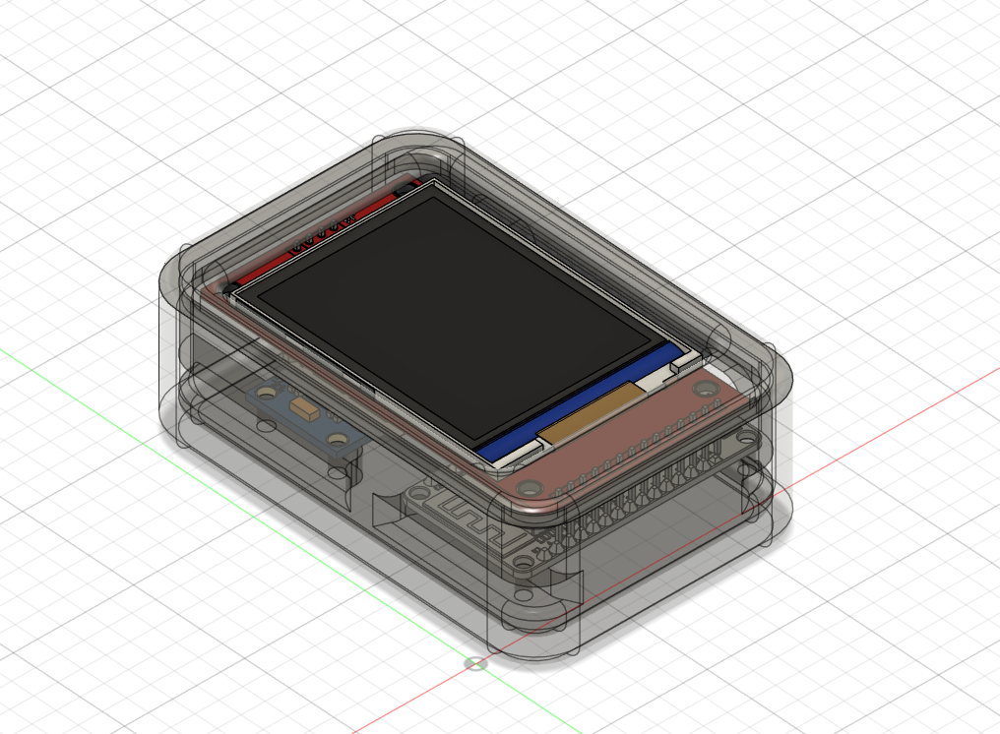
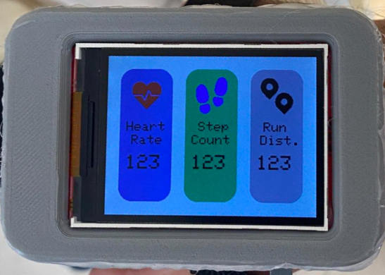
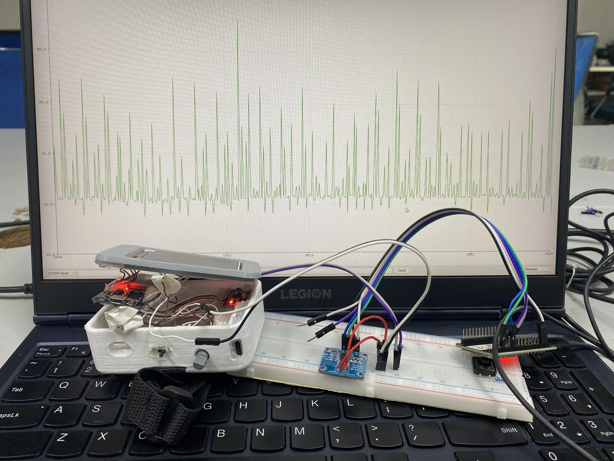

# ESP32 Fitness Tracker
This is my ESP32 Fitness Tracker Device for Microprocessor Engineering Classes

*Device prototype*

## Hardware
### The device contains some low-cost components :
* ESP32 Devkit (30 Pin)
* MAX30102 Oximeter and Heart Rate Sensor Module
* MPU-6050 3-Axis Accelerometer and Gyro Sensor
* ST7789 2.4 Inch TFT SPI LCD 
* EC11 Rotary Encoder
* 5V Buzzer
* TP4056 Lithium Battery Charge Controller & 1000mAh Lithium Battery
### Wiring
~~~C
// MPU6050
#define I2C_MASTER_SCL_IO 19
#define I2C_MASTER_SDA_IO 18

// MAX30102
#define MAX30102_I2C_SCL 22  
#define MAX30102_I2C_SDA 21      
#define MAX30102_GPIO_INT 23

// LCD
#define LCD_SCLK 14
#define LCD_MOSI 13
#define LCD_DC 12
#define LCD_CS 15
#define LCD_RST 26
#define LCD_LED 27

// Rotary Encoder 
#define ENCODER_A_GPIO 32
#define ENCODER_B_GPIO 33
#define ENCODER_BUTTON_GPIO 25
~~~
### Enclosure
* Device enclosure was designed in Fusion 360  
* Dimension : 87x60x31mm
## Software
* ESP-IDF Framework 5.2.1
* SparkFun MAX3010x sensor library
* MPU6050 ESP component registry library
* LovyanGFX SPI LCD graphics library
## Device Features
`✅` Pedometer  
`✅` Calculate running distance based on step counted and user-provided stride length  
`✅` Measuring heart rate  
`🔳` warning when user's heart rate exceed pre-set value  
`🔳` Calculate Calories based on BMR (Basal Metabolic Rate) and MET (Metabolic Equivalent)

  
*Device image*

*Measuring power consumption*

## Reference

* [Pedometer and calorie calculator for fitness tracking using MEMS digital accelerometer](https://ieeexplore.ieee.org/document/7823237)
